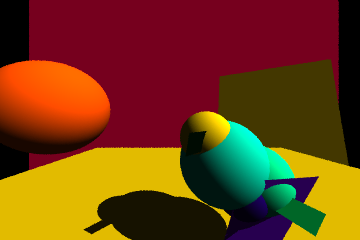
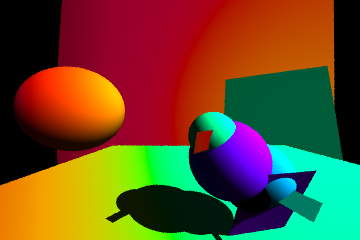
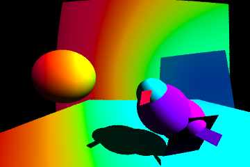
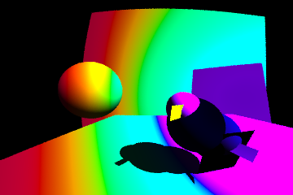
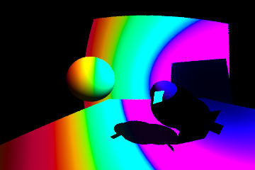
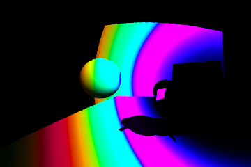
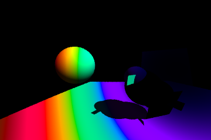
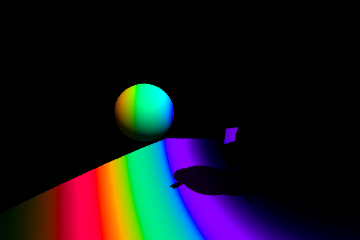

# Ray tracer
A ray tracer built as a platform for visualising relativistic effects -
special relativity first, then geodesic tracing in curved spacetime.

The personal reason for this project is to actually see what happens at different speeds, rather than taking facts from books as is.

### Current state:
Full SR demonstration (Doppler + aberration + beaming) on speeds $\beta = 0$ through $0.5$, camera movement vector (1, 0, -1) = forward-right diagonal, light_direction = (-1, -1, -0.5):

| β = 0 | β = 0.1 |
|:---:|:---:|
|  |  |

| β = 0.2 | β = 0.3 |
|:---:|:---:|
|  |  |

| β = 0.4 | β = 0.5 |
|:---:|:---:|
|  |  |

Each object emits at a single wavelength, so the Doppler shift is a shift of that one wavelength. This is why the scene has no white or grey surfaces - white light is a broad spectrum, which a monochromatic model cannot represent. Colours are converted to sRGB through the CIE 1931 colour matching functions (Wyman, Sloan & Shirley analytic fit), then desaturated into gamut and gamma-corrected.

### Plan
- [x] PPM output
- [x] Sphere intersection
- [x] Lambertian shading
- [x] Hittable abstraction
- [x] Shadows 
- [x] Coloring
- [x] SR: [Aberration](./docs/aberration.md)
- [x] SR: [Doppler](./docs/doppler.md)
- [x] SR: [Beaming](./docs/beaming.md)
- [ ] Schwarzschild geodesics
- [ ] Kerr

The last two items depend on differential geometry coursework and self-study, so they're paced by that rather than by the code.

### Rendering improvements
Independent of the physics track above

- [ ] Point light sources with distance falloff
- [ ] Emissive objects (visible light sources)
- [ ] Reflections (recursive ray_color)
- [ ] Full spectral rendering instead of single wavelength
- [ ] Multithreading (std::thread over scanlines)
- [ ] GPU port
- [ ] Real-time viewer with free camera

## Usage
Program outputs a .ppm file. Can be opened in VSCode via [Extension](https://marketplace.visualstudio.com/items?itemName=ngtystr.ppm-pgm-viewer-for-vscode)

## Build
```
g++ -std=c++17 -O2 -Wall main.cpp -o main.exe
./main.exe
```

## Archive

**Sphere detection**. Finding intersection of a ray and a sphere for each pixel


---
**Brightness** is a dot product between object's normal in that point and -light_direction 


---
Made a **hittable_list** object that stores all the scene objects. hittable_object.hit() considers all the objects within it and provides the closest hit


---
Added finite **plane** object


---
**Shadow**. Shot another ray in direction of object's normal in that point and see if it is blocked by another object


---
**Color** is a separate parameter set for each object


---
**Smoother edges**: for each pixel, shot not one but many rays with random offset within that pixel size. Then even out the color


---
**Aberration** demonstration. Camera movement vector (-1, 0, -1) = forward-left diagonal -> world becomes more squeezed to point far in movement direction


---


**Doppler effect** demonstration on speeds $\beta = 0$ through $0.5$, camera movement vector (1, 0, -1) = forward-right diagonal, light_direction = (-1, -1, -0.5):

| β = 0 | β = 0.1 |
|:---:|:---:|
|  |  |

| β = 0.2 | β = 0.3 |
|:---:|:---:|
|  |  |

| β = 0.4 | β = 0.5 |
|:---:|:---:|
|  |  |
---