# Ray tracer
A ray tracer built as a platform for visualising relativistic effects -
special relativity first, then geodesic tracing in curved spacetime.

The personal reason for this project is to actually see what happens at different speeds, rather than taking facts from books as is.

### Current state:
doppler effect demonstration on speeds $\beta = 0$, $0.1$, $0.2$ and $0.3$, camera movement vector (0, 0, -1) - forward, light_direction = (-1, -1, -0.5):

| β = 0 | β = 0.1 |
|:---:|:---:|
| 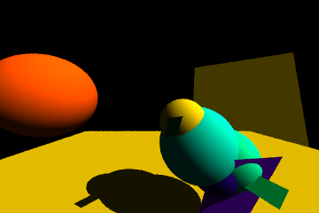 | 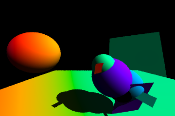 |

| β = 0.2 | β = 0.3 |
|:---:|:---:|
| 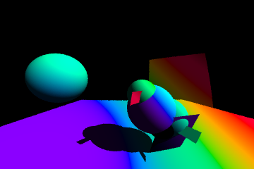 | 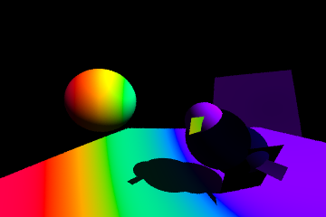 |


### Plan
- [x] PPM output
- [x] Sphere intersection
- [x] Lambertian shading
- [x] Hittable abstraction
- [x] Shadows 
- [x] Coloring
- [ ] SR: [aberration](./docs/aberration.md), Doppler, beaming
- [ ] Schwarzschild geodesics
- [ ] Kerr

## Rendering improvements
Independent of the physics track above

- [ ] Point light sources with distance falloff
- [ ] Emissive objects (visible light sources)
- [ ] Reflections (recursive ray_color)
- [ ] Full spectral rendering instead of single wavelength
- [ ] Multithreading (std::thread over scanlines)
- [ ] GPU port
- [ ] Real-time viewer with free camera

## Usage
Program outputs a .ppm file. Can be opened in VSCode via [Extension](https://marketplace.visualstudio.com/items?itemName=ngtystr.ppm-pgm-viewer-for-vscode)

## Build
```
g++ -O2 -Wall main.cpp -o main.exe
./main.exe
```

## Archive
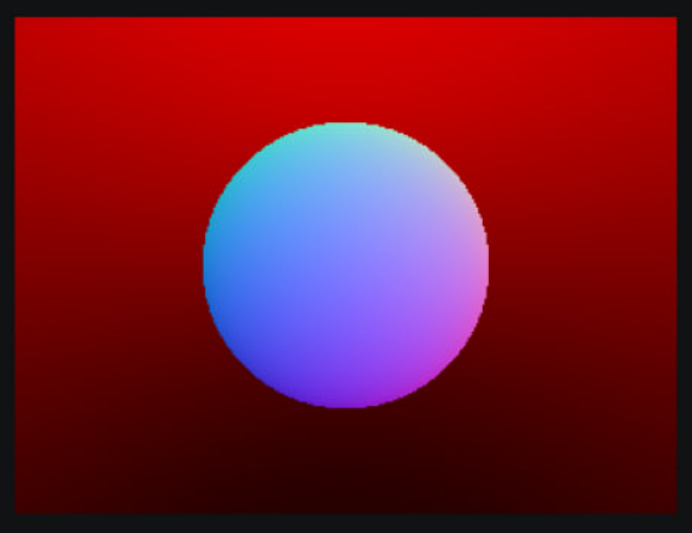
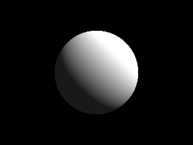
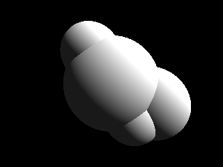
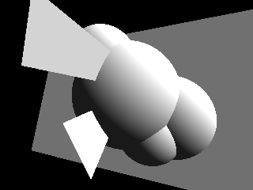
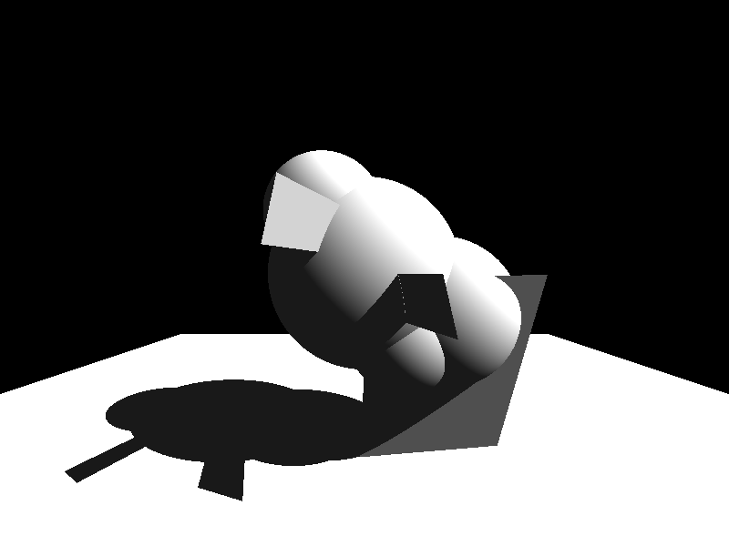
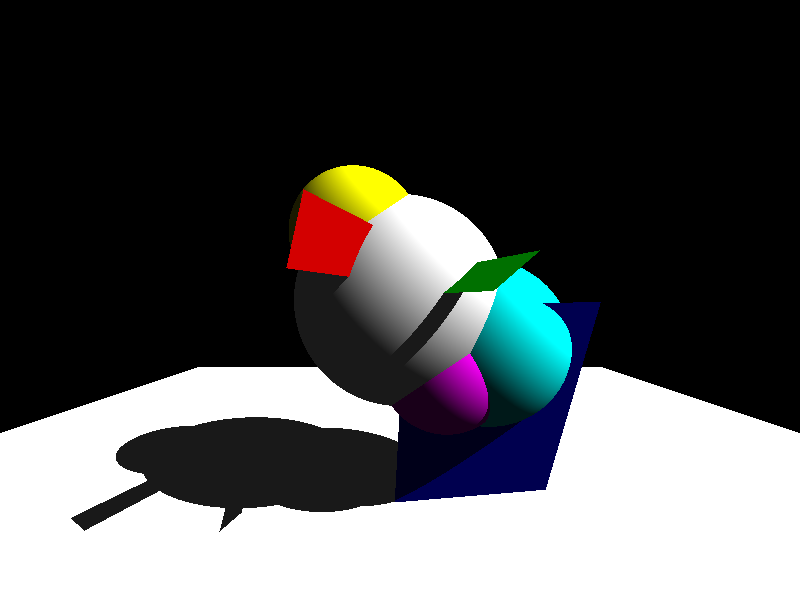
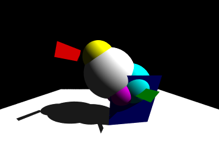
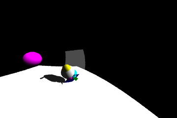
